<div align="center">

# TEE PortChecker

**Prüft, ob deine Ports wirklich aus dem Internet erreichbar sind — und sagt dir ehrlich, was der Test kann und was nicht.**

[](https://discord.gg/teebug)
[](https://linktr.ee/theersysending)

[](https://github.com/TheErsysEnding/TEE-PortChecker/actions/workflows/ci.yml)
[](LICENSE)
[](#voraussetzungen)
[](#voraussetzungen)

*[English version below ↓](#english)*

</div>

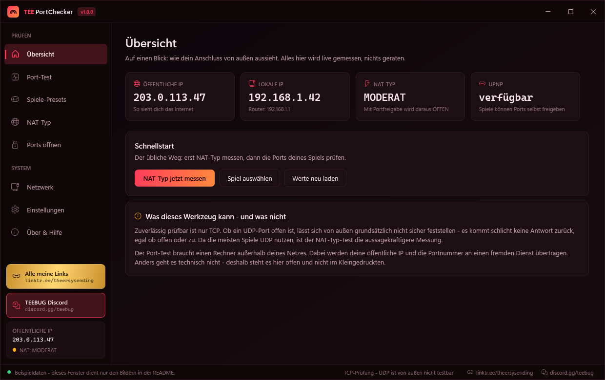

---

> ### 💙 Danke, dass du mein Tool benutzt!
>
> TEE PortChecker ist **kostenlos und quelloffen** und entsteht in meiner Freizeit.
> Wenn es dir hilft, ist die beste Unterstützung: vorbeischauen, weitersagen,
> Fehler melden. Kostet nichts und hält das Projekt am Leben.
>
> **Discord:** [discord.gg/teebug](https://discord.gg/teebug) &nbsp;·&nbsp;
> **Alle Links:** [linktr.ee/theersysending](https://linktr.ee/theersysending)

<div align="center">
  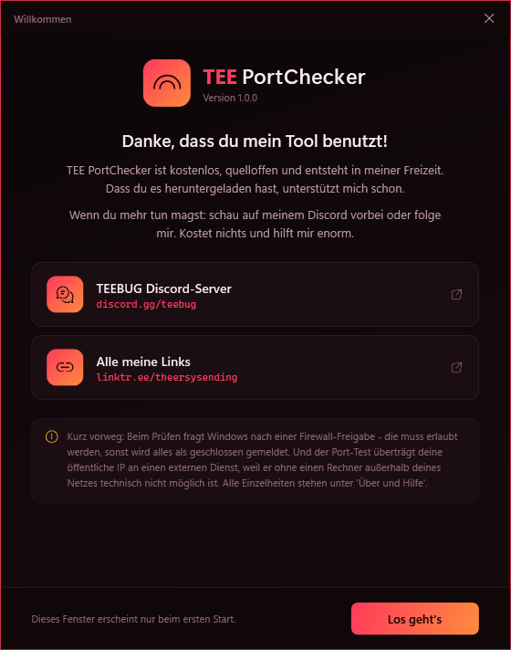
  <p><i>Beim ersten Start — danach nur noch auf Wunsch über „Über &amp; Hilfe".</i></p>
</div>

---

## Worum es geht

Wenn im Spiel „NAT-Typ: strikt" steht oder dein Minecraft-Server für Freunde
unerreichbar bleibt, hilft nur eine Frage: **Kommt von außen wirklich etwas durch?**

Das lässt sich vom eigenen Rechner aus nicht beantworten — dafür braucht es
jemanden im Internet, der von draußen anklopft. Genau das macht TEE PortChecker:

1. Es öffnet kurz einen lokalen Listener auf dem Port, der geprüft werden soll.
   *Ohne diesen Schritt meldet selbst eine korrekt eingerichtete Portweiterleitung
   „geschlossen", weil niemand die Verbindung annimmt.*
2. Ein Dienst außerhalb deines Netzes verbindet sich von außen auf deine
   öffentliche IP und genau diesen Port.
3. Kommt die Verbindung zustande → **offen**. Sonst → **zu**.

Zusätzlich misst TEE PortChecker deinen **NAT-Typ** mit derselben Technik, die Spiele
und Videochats benutzen (STUN).

## Was das Werkzeug NICHT kann

Diese Liste steht bewusst weit oben und nicht im Kleingedruckten:

- **UDP ist von außen nicht zuverlässig prüfbar.** Ein geschlossener UDP-Port
  antwortet genauso wenig wie ein offener. Da die meisten Spiele UDP nutzen,
  ist der NAT-Typ-Test die aussagekräftigere Messung.
- **Der Port-Test überträgt deine öffentliche IP und die Portnummer an einen
  fremden Dienst** (`ports.yougetsignal.com`, ersatzweise `canyouseeme.org`).
  Ohne einen Rechner außerhalb deines Netzes ist so ein Test technisch unmöglich.
  → [Was genau nach außen geht](#was-nach-außen-geht)
- **Beim NAT-Typ ist nur das Mapping-Verhalten messbar** (RFC 5780). Das
  Filter-Verhalten — wer zurückschicken darf — bräuchte einen Server mit einer
  zweiten IP-Adresse. Deshalb steht bei gutmütigem NAT hier `MODERAT` und nicht
  vorschnell `OFFEN`.
- **Der externe Dienst begrenzt Anfragen.** Große Bereiche dauern deshalb lange.
  Schneller geht es nicht, ohne gesperrt zu werden.

## Start

```bash
git clone https://github.com/TheErsysEnding/TEE-PortChecker.git
```

Dann **`TEE-PortChecker.bat`** doppelklicken. Das war's — es wird nichts installiert,
nichts in die Registry geschrieben und keine Adminrechte verlangt.

| Datei | Wozu |
|---|---|
| `TEE-PortChecker.bat` | Grafische Oberfläche |
| `TEE-PortChecker-Konsole.bat` | Textfassung für Server ohne Desktop |

> **Windows-Firewall:** Beim ersten Start fragt Windows nach einer Freigabe.
> Diese **muss erlaubt werden** — ohne sie kann der lokale Listener keine
> Verbindungen annehmen und alles wird als „geschlossen" gemeldet.

### Voraussetzungen

Windows 10 oder 11 mit Windows PowerShell 5.1 — das ist ab Werk installiert.
**Kein .NET-SDK, kein Installer, keine Fremdmodule.**

---

## Funktionen

### Port-Test

Einzelne Ports, Bereiche und Mischungen (`80,443,3074` oder `27000-27050`).
Ergebnisse laufen live ein, der Test lässt sich jederzeit abbrechen, und alles
kann als CSV, JSON oder Textbericht exportiert werden.

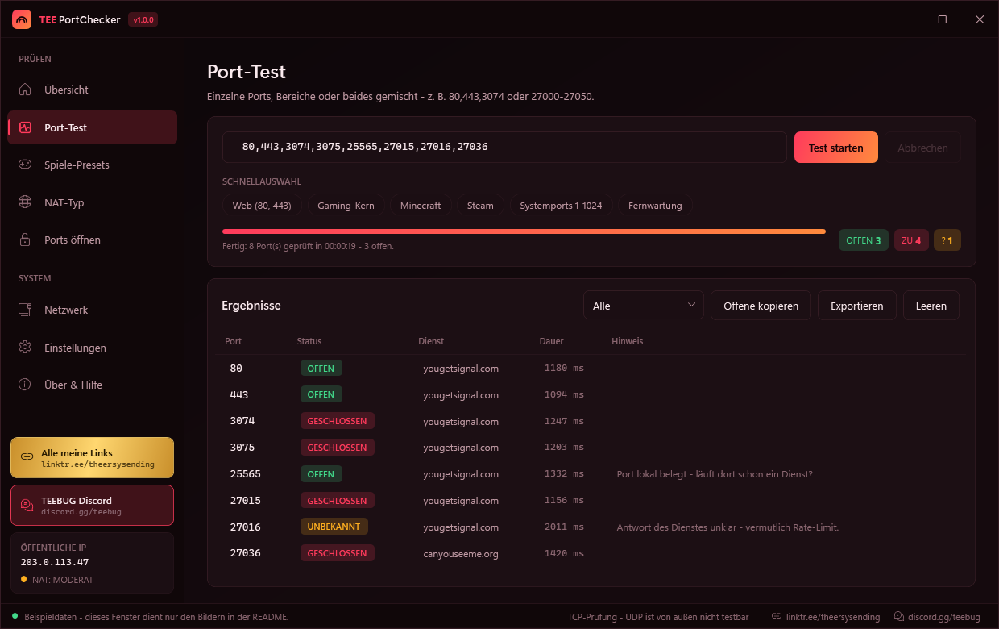

### Spiele-Presets

83 fertige Portlisten aus den offiziellen Hersteller-Angaben — von Konsolen über
die komplette Call-of-Duty-Reihe bis zu Server-Ports.

**Konsolen-Einträge erben automatisch die Basisports ihrer Plattform.**
„Black Ops II (PS3)" ist also PS3-Basisports **plus** die titelspezifischen Ports —
genau so, wie es der Hersteller-Support beschreibt. Dadurch gibt es die Portdaten
nur an einer einzigen Stelle, und eine Korrektur wirkt sofort überall.

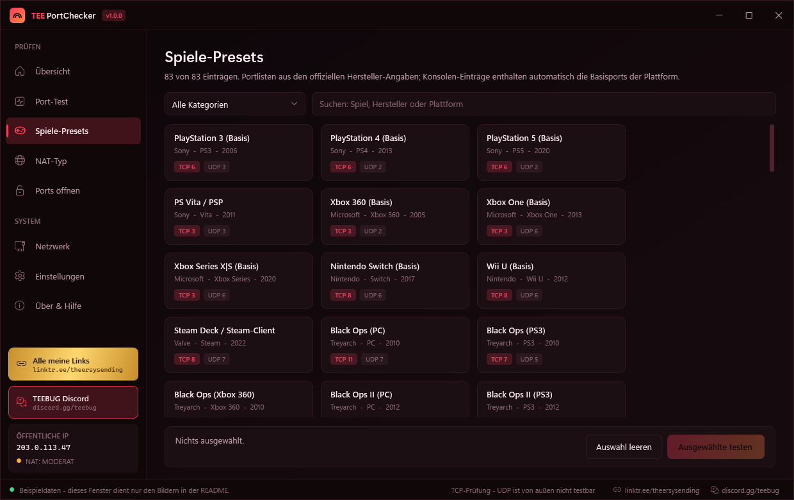

<details>
<summary><b>Alle 83 Presets ausklappen</b></summary>

| Kategorie | Einträge |
|---|---|
| **Konsolen** | PS3, PS4, PS5, PS Vita/PSP, Xbox 360, Xbox One, Xbox Series X\|S, Nintendo Switch, Wii U, Steam Deck |
| **Call of Duty** | Black Ops (PC/PS3/X360), Black Ops II (PC/PS3/X360/Wii U), Black Ops III (PC/PS3/PS4/XB1/X360), Black Ops 4, Cold War, Black Ops 6, MW2 (2009), MW3 (2011), Ghosts, Advanced Warfare, WWII, MW (2019), Warzone, MW II (2022), MW III (2023) |
| **Shooter** | Counter-Strike 2/CS:GO, Valorant, Rainbow Six Siege, Battlefield, Titanfall 2, Overwatch 2, Halo, Escape from Tarkov, Team Fortress 2 |
| **Battle Royale** | Fortnite, PUBG, Apex Legends, Fall Guys |
| **Survival & Sandbox** | Minecraft Java, Minecraft Bedrock, ARK, Rust, Valheim, Palworld, Terraria, DayZ, Satisfactory, 7 Days to Die, Project Zomboid |
| **Rennen & Sport** | Rocket League, EA SPORTS FC/FIFA, Forza, GTA Online, Red Dead Online |
| **MMO & RPG** | World of Warcraft, Diablo, Destiny 2, League of Legends, Dota 2, Final Fantasy XIV, Warframe, Elden Ring/Dark Souls, Roblox, Sea of Thieves |
| **Plattformen** | Battle.net, Epic Games, EA App/Origin, Ubisoft Connect |
| **Voice & Chat** | Discord, TeamSpeak 3, Mumble |
| **Server & Sonstiges** | Web & Fernwartung, Selfhosting (Plex/Jellyfin/VPN), Systemports 1-1024 |

</details>

### NAT-Typ

Fragt mehrere STUN-Server über **denselben lokalen Socket** ab — nur so ist
vergleichbar, ob dein Router für unterschiedliche Ziele dieselbe öffentliche
Adresse benutzt.

- Überall gleich → **Cone-NAT**, gutmütig
- Wechselnde Ports → **symmetrisches NAT**, streng
- Adresse in `100.64.0.0/10` → **CGNAT**, Portweiterleitung technisch unmöglich

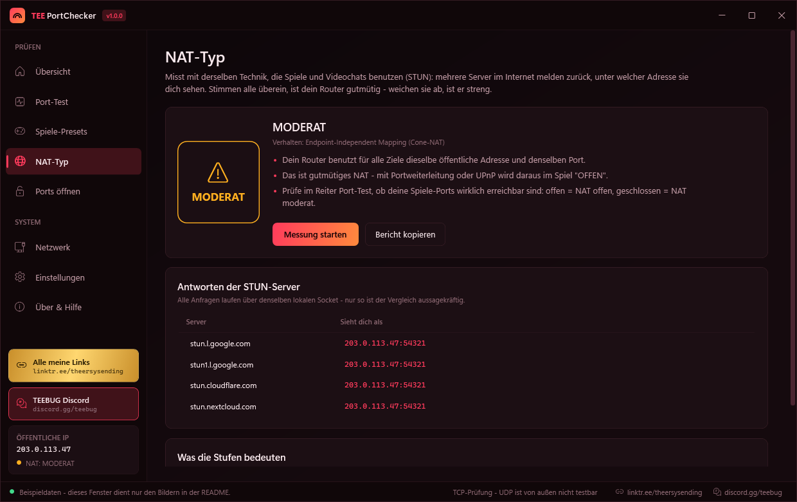

### Ports öffnen

Der Test sagt dir, dass ein Port zu ist. Diese Seite sagt dir, was du dagegen
tun kannst: Portweiterleitung Schritt für Schritt, mit den Menüpfaden der
verbreitetsten Router — denn jeder Hersteller nennt es anders, und selbst
zwischen zwei Firmware-Ständen desselben Modells wandert der Menüpunkt.

Dazu ehrlich, wann es **nicht** am Router liegt: CGNAT, doppeltes NAT und
Mobilfunk. In diesen Fällen hilft nur der Anbieter — oder ein VPN-Dienst mit
Portweiterleitung.

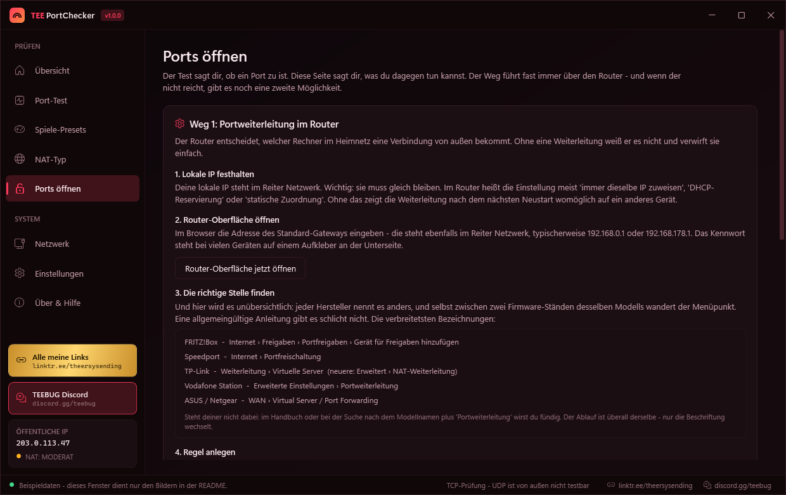

### Netzwerk & UPnP

Adapter, Gateway, DNS — und eine SSDP-Suche nach UPnP-fähigen Routern. Antwortet
dein Router, können Spiele Ports selbst freigeben und du sparst dir die Handarbeit.

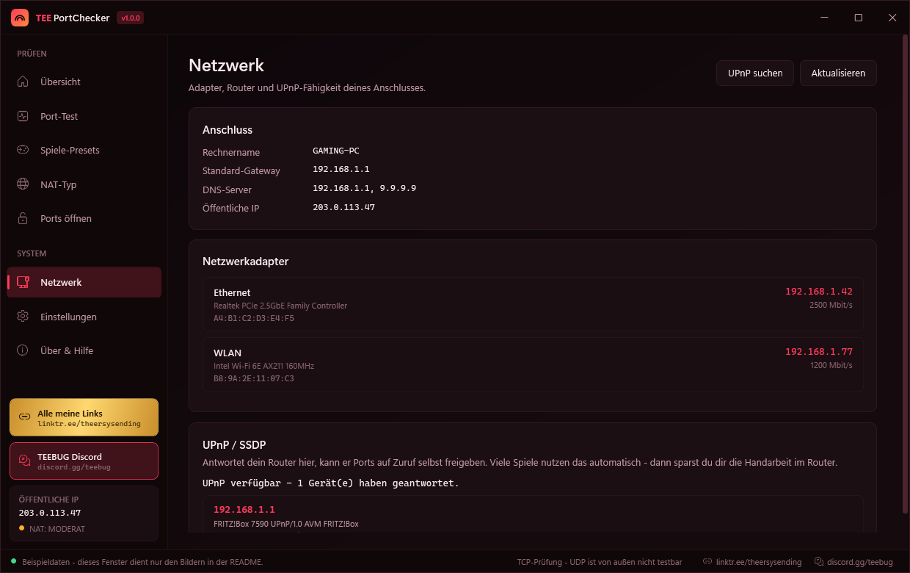

---

## Acht Farbwelten

Umschaltbar im laufenden Betrieb, die Auswahl wird gemerkt.

**Crimson** ist die Voreinstellung — oben im ersten Bild zu sehen.

| Midnight — Cyan auf Tiefschwarz | Toxic — Giftgrün, Terminal-Optik |
|---|---|
| 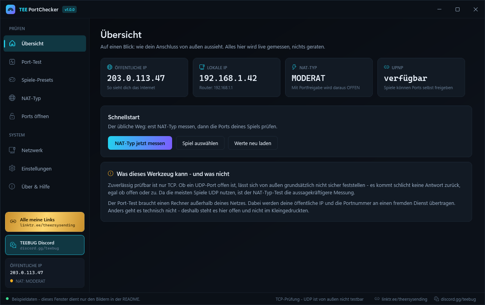 | 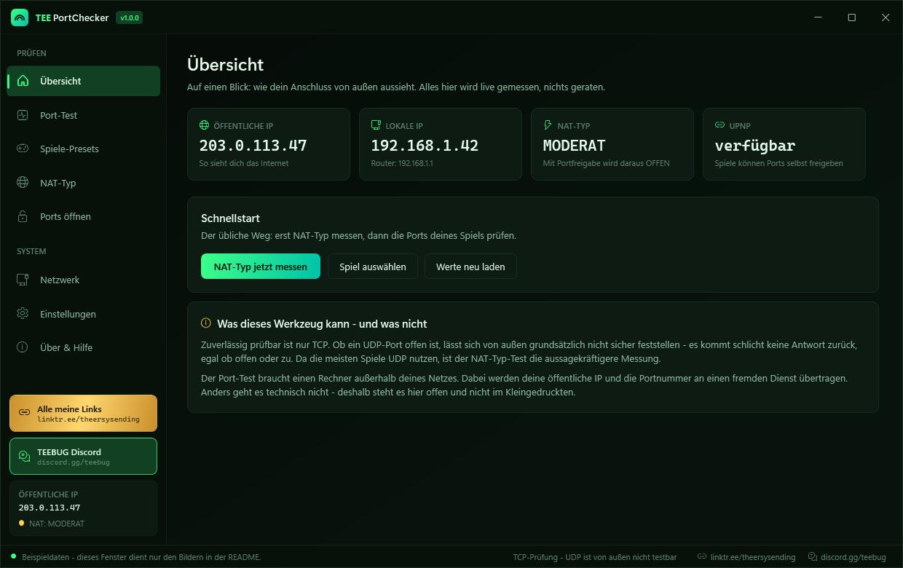 |
| **Ultraviolet** — Violett und Pink | **Amber** — Bernstein, warmes Dunkel |
| 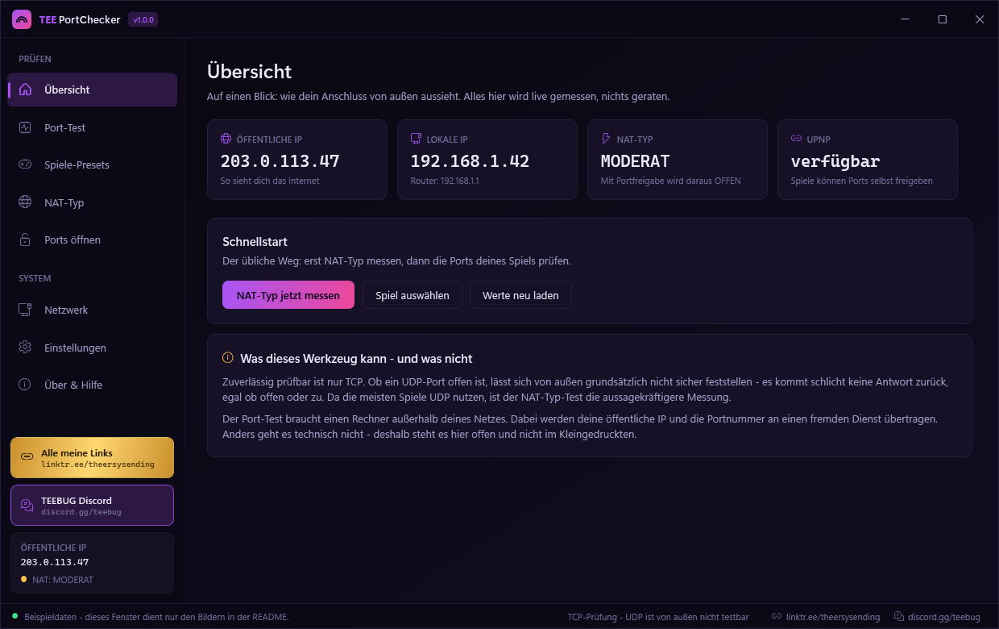 | 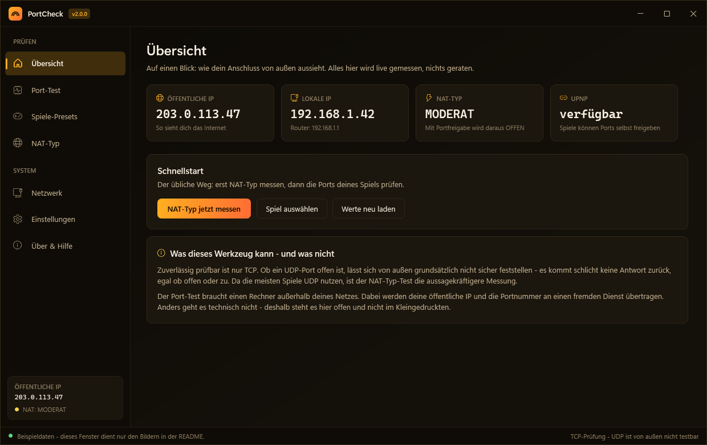 |
| **Arctic** — Eisblau, ruhig | **Carbon** — neutrales Windows-11-Dunkel |
| 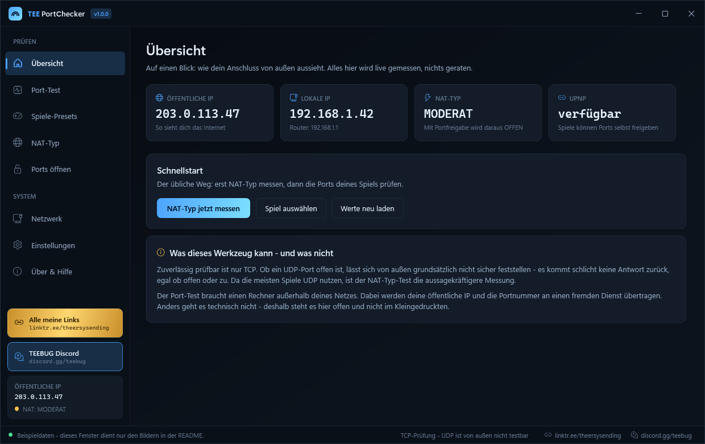 | 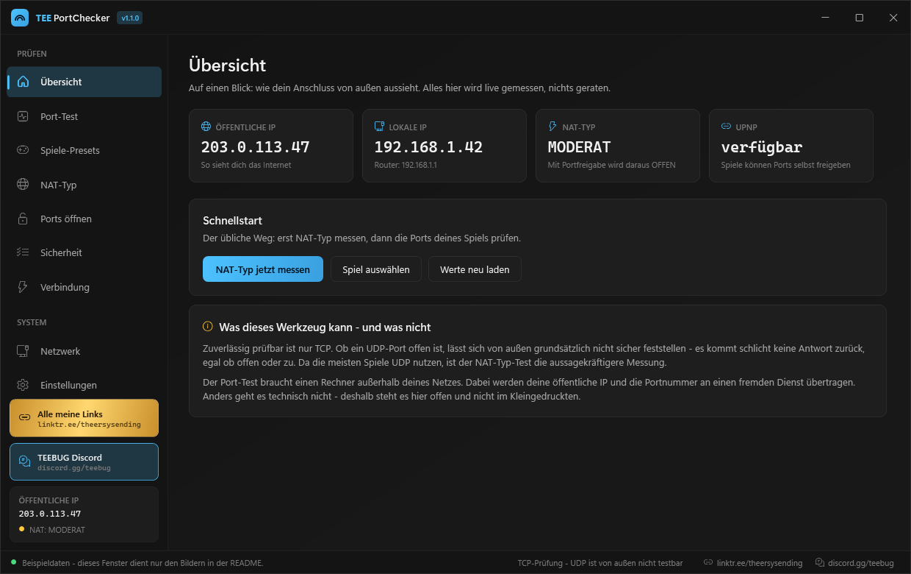 |
| **Daylight** — helles Windows-11-Design | |
| 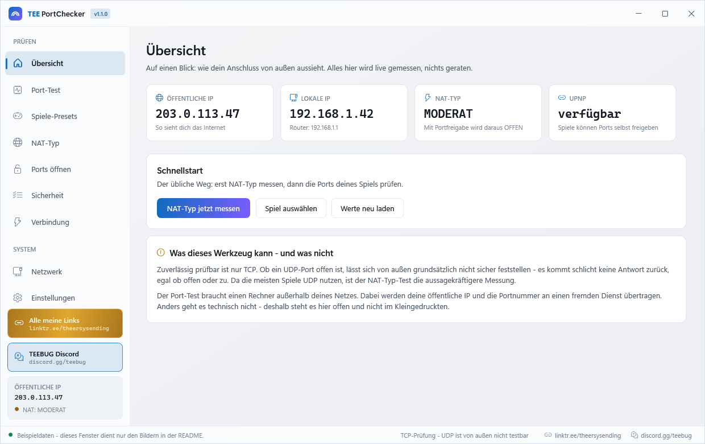 | |

Eigene Farbwelt bauen: in [`src/PortCheck.Themes.ps1`](src/PortCheck.Themes.ps1)
einen Block kopieren, Id vergeben, Hex-Werte ändern. Die Testsuite prüft
automatisch, dass kein Farbwert fehlt oder vertippt ist.

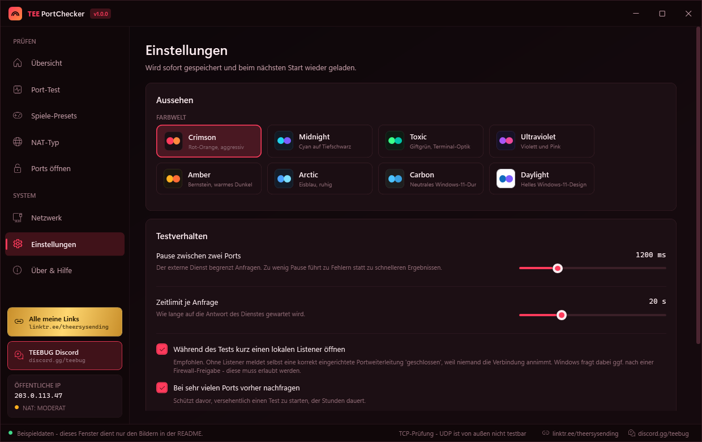

---

## Konsolenfassung

Gleiche Messtechnik, ohne Fenster — für Server, Fernwartung und Automatisierung.

```powershell
# Menü
.\src\PortCheck.Cli.ps1

# Direkt prüfen
.\src\PortCheck.Cli.ps1 -Ports "80,443,3074"
.\src\PortCheck.Cli.ps1 -Ports "27000-27050" -Csv ergebnis.csv -NonInteractive

# Preset prüfen
.\src\PortCheck.Cli.ps1 -Preset bo2-ps3
.\src\PortCheck.Cli.ps1 -ListPresets

# Nur NAT-Typ
.\src\PortCheck.Cli.ps1 -NatOnly
```

| Schalter | Bedeutung |
|---|---|
| `-Ports "<liste>"` | Ports direkt prüfen |
| `-Preset <id>` | Preset prüfen (Ids über `-ListPresets`) |
| `-Csv <pfad>` | Ergebnis als CSV ablegen |
| `-NatOnly` | nur die NAT-Messung |
| `-DelayMs <n>` | Pause zwischen zwei Ports (Standard 1200) |
| `-NoListener` | ohne lokalen Listener (keine Firewall-Abfrage, dafür ungenauer) |
| `-NonInteractive` | keine Rückfragen — für Skripte |

---

## Was nach außen geht

Vollständige Liste. Es gibt keine Telemetrie, keine Konten und keine Werbung.

| Funktion | Ziel | Übertragen wird |
|---|---|---|
| Port-Test | `ports.yougetsignal.com`, ersatzweise `canyouseeme.org` | deine öffentliche IP + die Portnummer |
| IP ermitteln | `api.ipify.org`, `ifconfig.me`, `checkip.amazonaws.com`, `icanhazip.com` | nur die Anfrage — der Dienst sieht, was jeder Webserver sieht |
| NAT-Typ | STUN von Google, Cloudflare, Nextcloud, sipgate | leere STUN-Anfragen, keine Inhalte |
| UPnP-Suche | SSDP-Multicast | bleibt vollständig im lokalen Netz |

Gespeichert wird ausschließlich `%APPDATA%\TEE-PortChecker\settings.json` mit den
Oberflächen-Einstellungen — **keine Messergebnisse, keine IP-Adressen, kein Verlauf.**

---

## Aufbau

```
TEE-PortChecker/
├─ TEE-PortChecker.bat              Start der Oberfläche
├─ TEE-PortChecker-Konsole.bat      Start der Textfassung
├─ src/
│  ├─ Gui.xaml                Aussehen und Anordnung (reines XAML)
│  ├─ PortCheck.Gui.ps1       Oberflächen-Logik, Hintergrund-Runspaces
│  ├─ PortCheck.Cli.ps1       Konsolenfassung
│  ├─ PortCheck.Core.ps1      Messlogik — ohne jede Oberfläche
│  ├─ PortCheck.Presets.ps1   Portlisten der Spiele
│  └─ PortCheck.Themes.ps1    Farbwelten
└─ tests/Run-Tests.ps1        100 Tests, ohne Fremdmodule
```

Die Trennung ist Absicht: **`PortCheck.Core.ps1` enthält kein einziges
`Write-Host` und kein Fenster.** Oberfläche, Konsolenfassung und die
Hintergrund-Runspaces benutzen exakt denselben Code — was du im Quelltext liest,
ist genau das, was gemessen wird.

### Warum PowerShell und nicht eine `.exe`?

Für ein Werkzeug, das Netzwerkverbindungen öffnet und Daten an einen fremden
Dienst schickt, ist **lesbarer Quelltext mehr wert als eine kompilierte Datei**,
der man vertrauen muss. Jede Zeile liegt im Klartext bei. Nebenbei gibt es damit
keinen Build-Schritt, keine Runtime-Abhängigkeit und keinen Virenscanner-Fehlalarm
durch eine unsignierte `.exe`.

### Tests

```powershell
.\tests\Run-Tests.ps1
```

102 Tests ohne Fremdmodule — Port-Parser, STUN-Parser (mit selbst gebauten
Paketen), NAT-Bewertung, Preset-Integrität, Farbwelten, XAML-Aufbau und
Zeichenkodierung. **Kein Test geht ins Internet**, sie laufen also auch offline.

Zusätzlich:

```powershell
# Baut das komplette Fenster auf und schaltet alles durch, ohne es anzuzeigen
.\src\PortCheck.Gui.ps1 -SelfTest

# Echte Messung durch die komplette Oberfläche, mit Bericht
.\src\PortCheck.Gui.ps1 -LiveTest "80,25565"
```

---

## Mitmachen

Besonders willkommen: **Korrekturen an den Portlisten.** Alle Portdaten stehen in
einer einzigen Datei ([`src/PortCheck.Presets.ps1`](src/PortCheck.Presets.ps1)),
jeweils mit Quellenangabe. Details in [CONTRIBUTING.md](CONTRIBUTING.md).

## Lizenz

[MIT](LICENSE) — frei nutzbar, veränderbar und weitergebbar.

---
---

<a name="english"></a>

# TEE PortChecker — English

**Checks whether your ports are actually reachable from the internet — and tells
you honestly what the test can and cannot do.**

## What it does

When a game reports "NAT type: strict" or friends cannot reach your Minecraft
server, only one question matters: **does anything actually get through from
outside?** You cannot answer that from your own machine — you need someone on the
internet to knock. That is what TEE PortChecker does:

1. It briefly opens a local listener on the port under test. *Without this step
   even a correctly configured port forward reports "closed", because nothing
   accepts the connection.*
2. A service outside your network connects to your public IP on that exact port.
3. Connection succeeds → **open**. Otherwise → **closed**.

It also measures your **NAT type** using STUN — the same technique games and
video chat use.

## What it cannot do

- **UDP cannot be reliably probed from outside.** A closed UDP port is just as
  silent as an open one. Since most games use UDP, the NAT type test is the more
  meaningful measurement.
- **The port test sends your public IP and the port number to a third-party
  service** (`ports.yougetsignal.com`, falling back to `canyouseeme.org`).
  Without a machine outside your network such a test is technically impossible.
- **Only NAT mapping behaviour is measurable** (RFC 5780). Filtering behaviour
  would require a server with a second IP address. That is why friendly NAT is
  reported as `MODERATE` here rather than prematurely `OPEN`.
- **The external service rate-limits requests**, so large ranges take a while.

## Getting started

```bash
git clone https://github.com/TheErsysEnding/TEE-PortChecker.git
```

Double-click **`TEE-PortChecker.bat`**. Nothing is installed, nothing is written to the
registry, no admin rights are required. Requires Windows 10/11 with Windows
PowerShell 5.1 (present out of the box) — no .NET SDK, no third-party modules.

**Windows Firewall:** allow the prompt on first run. Without it the local
listener cannot accept connections and everything reports as closed.

> The user interface is in German. The code, comments and this section are
> English-friendly; a translated UI is a welcome pull request.

## Features

- **Port test** — single ports, ranges and mixes; live results, cancellable,
  export to CSV/JSON/text
- **83 game presets** — consoles, the full Call of Duty series, shooters,
  survival, servers. Console entries automatically inherit their platform's base
  ports, so port data lives in exactly one place
- **Opening ports** — step-by-step port forwarding guide with the menu paths of
  the most common routers, plus an honest section on when it is *not* the
  router's fault (CGNAT, double NAT, mobile connections)
- **NAT type** — multiple STUN servers queried over a single socket, which is the
  only way the comparison is meaningful; detects CGNAT (`100.64.0.0/10`)
- **Network & UPnP** — adapters, gateway, DNS, SSDP discovery
- **8 themes** — switchable at runtime, choice is remembered

## Command line

```powershell
.\src\PortCheck.Cli.ps1 -Ports "80,443,3074"
.\src\PortCheck.Cli.ps1 -Preset bo2-ps3
.\src\PortCheck.Cli.ps1 -NatOnly
.\src\PortCheck.Cli.ps1 -ListPresets
```

## Tests

```powershell
.\tests\Run-Tests.ps1
```

102 tests, no third-party modules, no network access — they run offline.

## Why PowerShell instead of a compiled `.exe`?

For a tool that opens network connections and sends data to a third-party
service, **readable source is worth more than a binary you have to trust.**
Every line ships in plain text. As a bonus: no build step, no runtime dependency,
and no antivirus false positive from an unsigned executable.

## License

[MIT](LICENSE)
